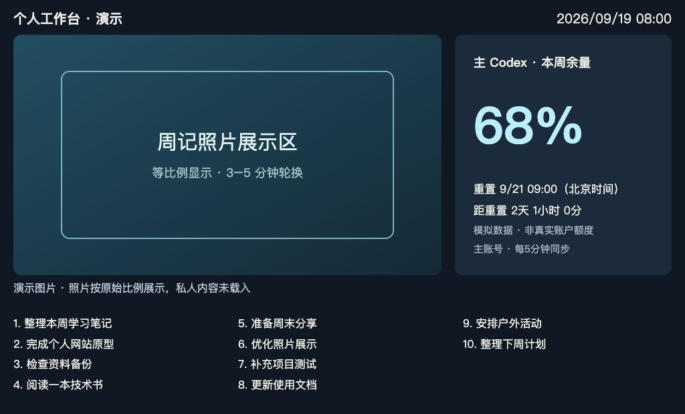

# 天猫精灵个人看板：公开复现包 v1.0
整理日期：2026-09-18。

把带屏天猫精灵变成个人工作台：轮播周记照片、查看 Codex 周额度和重置时间、展示周记中的下周待办。支持 Web 浏览器访问，两端共用数据，由 Mac mini 或其他适配的常驻电脑提供服务。

## 功能简介

- **照片轮播**：保持原图比例，随机队列每3–5分钟切换。
- **额度看板**：显示主 Codex 周余量、重置时间及倒计时，不是现金余额或会员到期日。
- **周记待办**：只读提取最新周记的下周待办，最多显示12项。
- **清晰布局**：宽屏照片在左、额度在右、待办三列；右上显示北京时间，窄屏自动堆叠。
- **双端共用数据**：Web 和天猫精灵 Waft 页面共用后端快照，各自渲染。

## 界面预览



这是 **Web端演示截图，不是天猫精灵实机截图**。额度、日期和待办均为演示数据；照片区域使用无私人信息的占位示意。实际使用时可接入自己的照片。待办打勾尚未实现。

本地重现此预览：在example目录运行 `node scripts/preview-demo.mjs`，打开 `http://127.0.0.1:8799`。该演示仅监听本机，不读取凭据、真实照片、周记或Codex账户；正常服务仍按下方快速开始启动。

## 项目与作者

作者：**熊哥 AI 军团** · 视频号：**熊哥 AI 军团** · [GitHub](https://github.com/beargege-sz)

面向爱好者交流的个人看板实践，欢迎复现、反馈和改进。本项目非天猫精灵、阿里巴巴或 OpenAI 官方项目，不承诺所有设备和平台账号均可接入。

自有代码与随附原创文档采用 [MIT 许可证](LICENSE)，允许依许可使用、修改、分发和商用。第三方依赖、商标及外部资料不因本许可证而被重新授权，详见 [第三方说明](THIRD_PARTY_NOTICES.md)。

先读《天猫精灵看板技术实现文档.md》，再把《交给开发工具的任务书.md》交给自己的 Codex 或其他开发工具。
本包包含脱敏的真实屏显源码、Web界面、数据读取模块，以及一个专门重写的最小服务入口。
**不是原项目完整导出，也不含部署权限、私人数据或预编译设备包。**

- 只在原案例 TG_S2A / CCL、6.1.8-RS-20221104.1459 上有历史真机成功记录，不保证所有型号/账号/当前平台入口可用。
- 本包本地测试/构建结果见《验证与脱敏报告.md》；公开包未重新在另一台天猫精灵部署。
- 未实现触屏完成待办、设备授权登录、自动续证或局域网HTTPS直连。
- 示例以空额度启动，绝不显示伪造的“真实余额”。演示文案均为虚构。
- 不包含npm依赖源码；安装时遵守各依赖自身许可证。本包没有替第三方平台授予接入权限。

## 快速开始
进入 example 目录，用 Node.js 22 或更高的兼容版本：
```bash
npm ci --ignore-scripts
cp .env.example .env
```
分别生成两个令牌，填入.env（不要使用同一个令牌）：
```bash
node -e "console.log(require('node:crypto').randomBytes(32).toString('hex'))"
```
执行：
```bash
npm start
```
浏览器访问 http://127.0.0.1:8787/?view=你自己生成的查看令牌 。不要直接双击 public/index.html。
默认只有虚构周记，无照片；自行放入 example-data/journals/2026/photos 的测试JPEG，不要先放私人照片。
Web 页显示待办、时间；额度显示 -- 是正常的，表示尚未接入真实采集。
运行 `npm test`；屏显另在 screen 目录执行 `npm ci --ignore-scripts`、`npm run build`。
部署公网前，请完整阅读技术文档的HTTPS、鉴权、日志与隐私章节。
